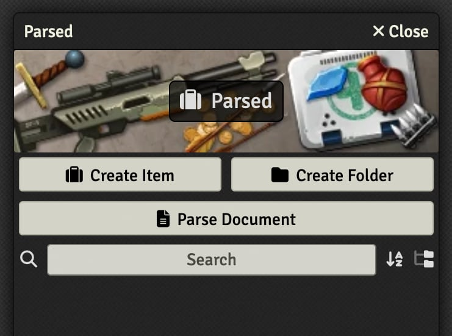
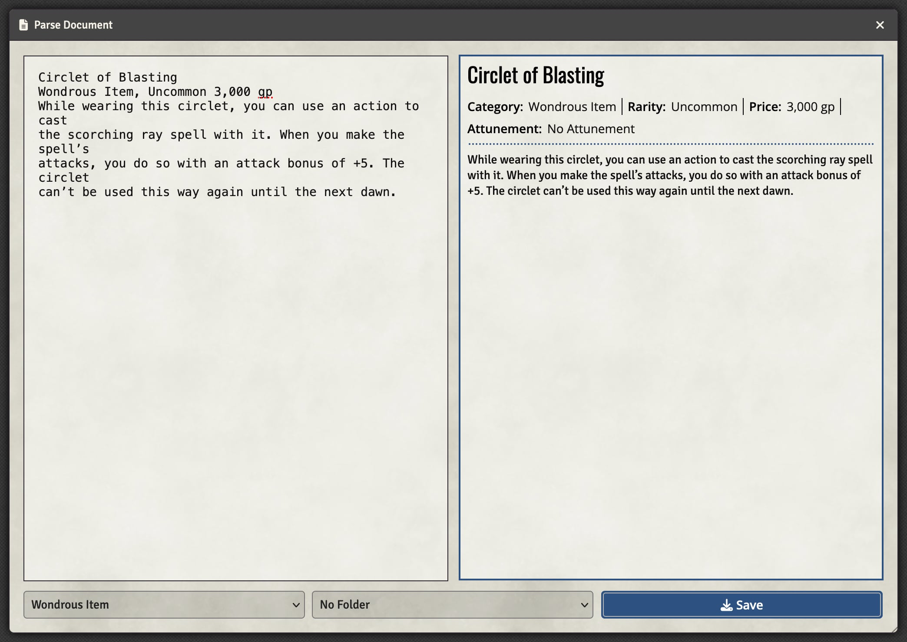
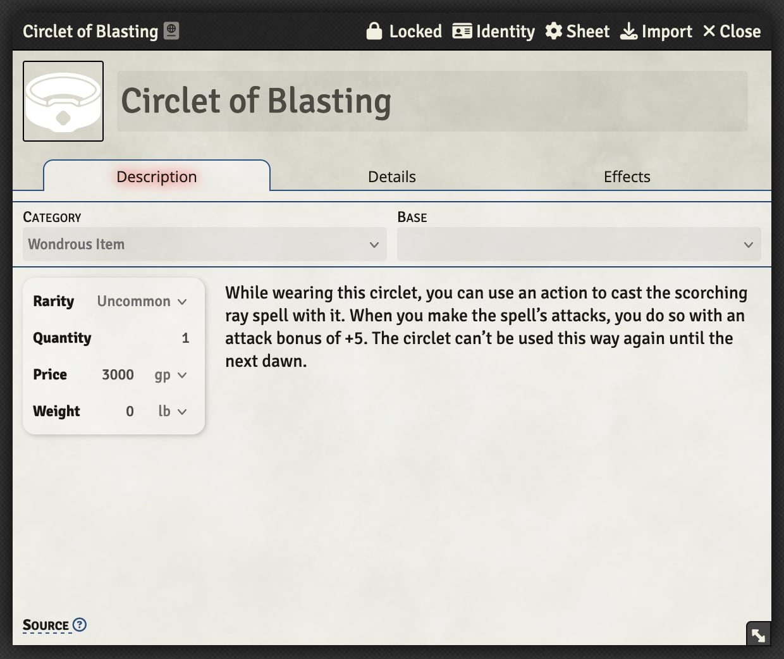
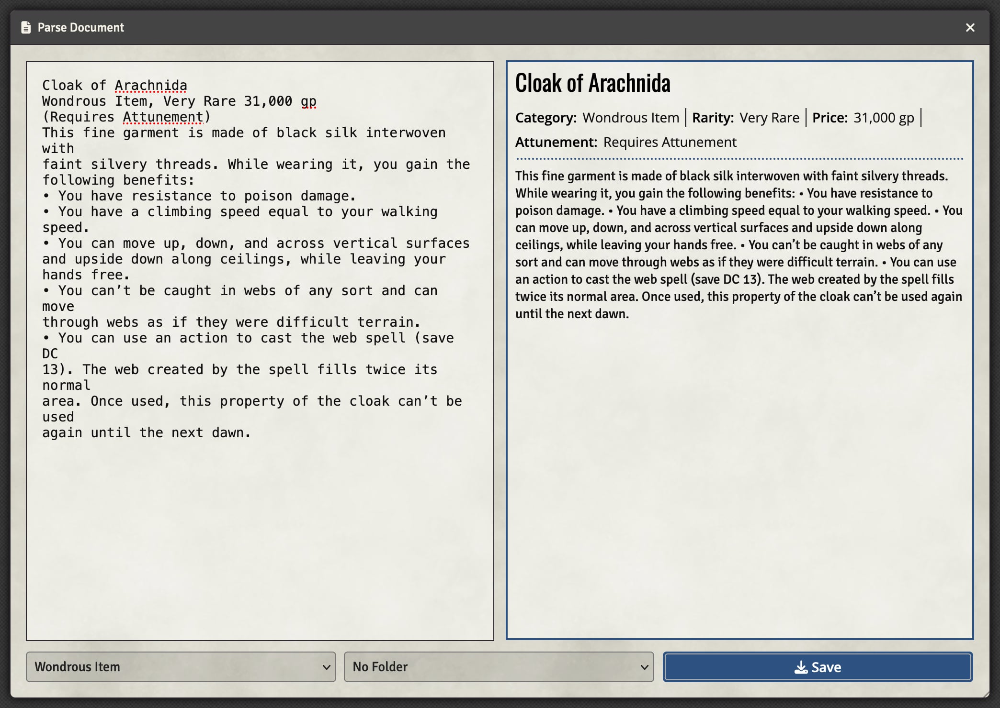
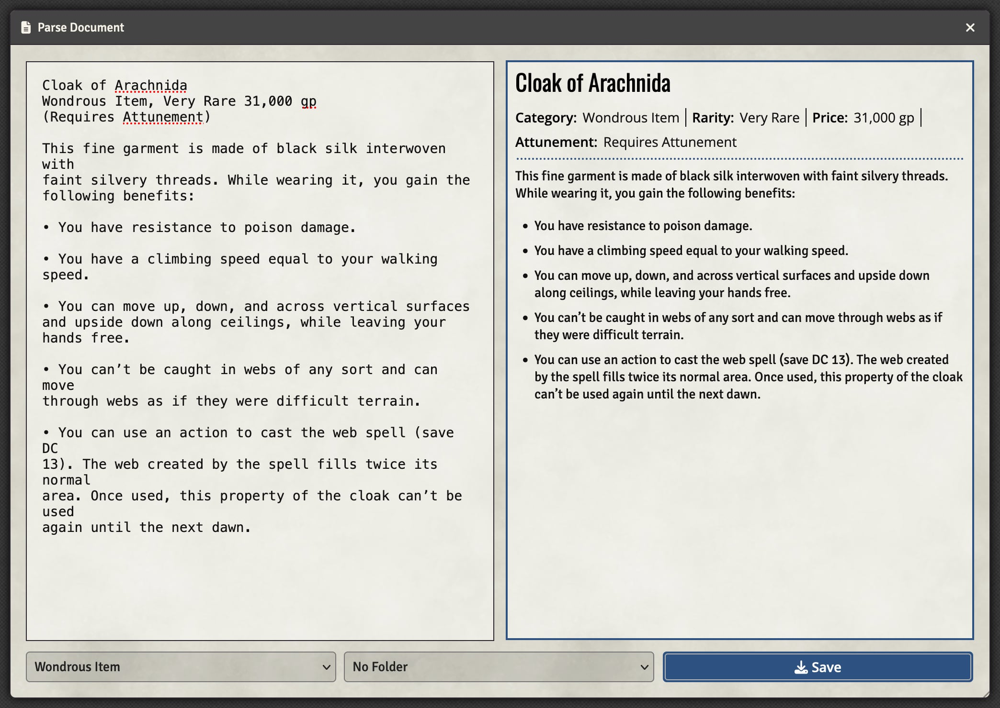

The parsing tool within [Black Flag Roleplaying Content Tools](https://github.com/koboldpress/black-flag-tools) allows importing items from plain text into the Black Flag system. Follow the instructions on the module page above to install the module before continuing.

The parser is designed to work with text formatting in the standard Black Flag style. It currently works for magic items and spells.

To access the parser, launch a world using the Black Flag game system with the Black Flag Conversion Tools mod enabled. Find the compendium you wish to parse into, unlock it using the context menu, and then open it up. The "Parse Document" button should be visible at the top beneath the standard "Create" buttons and above the search field:

Clicking on this button brings up the document parsing window. It is split into the input section on the left, the output preview on the right, and a few controls along the bottom. Between by pasting in the text content into the left field and selecting the appropriate item type from the bottom left. This should cause a preview of the parsed item to be shown on the right:

If desired, you can select a folder to place the newly created document into. Once everything looks good, push the "Save" button and the sheet for the newly created document should open:

The parser is able to fill in a bunch of details for the created items, but some things will have to be handled manually such as the icon, activities, and active effects.

#### Spacing in Descriptions

The parser is designed to handle the weird line breaks that happen when copying directly from a PDF file. Because of this, you will have to modify your pasted input to add extra line breaks between paragraphs. Without these line breaks, the description will be one large block:

Adding some extra line breaks where they appear in the original text will help the parser distinguish between paragraphs and properly create lists in the final document:

