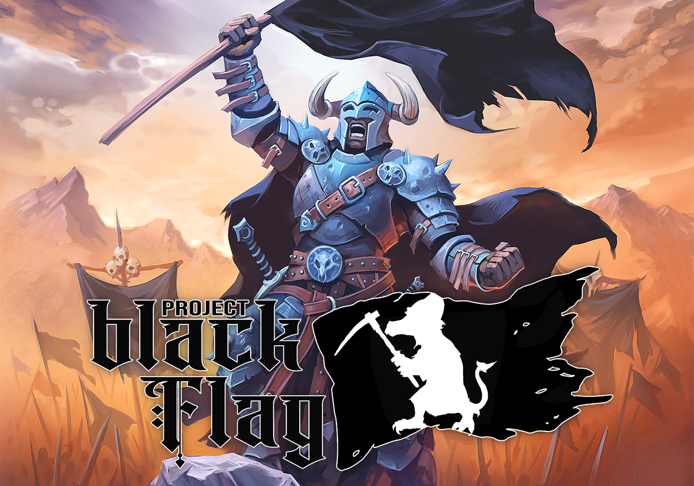

This site provides documentation and guides for the **Black Flag Roleplaying** game system for Foundry VTT. Black Flag is a 5E-compatible game system that powers Kobold Press's **[Tale of the Valiant](https://www.talesofthevaliant.com)** roleplaying game.

- Changelogs
  - [Black Flag System](changelogs/system)
  - [Monster Vault](changelogs/monster-vault)
- Documentation
  - [Active Effects](documentation/active-effects)
  - [Roll Formulas](documentation/roll-formulas)
